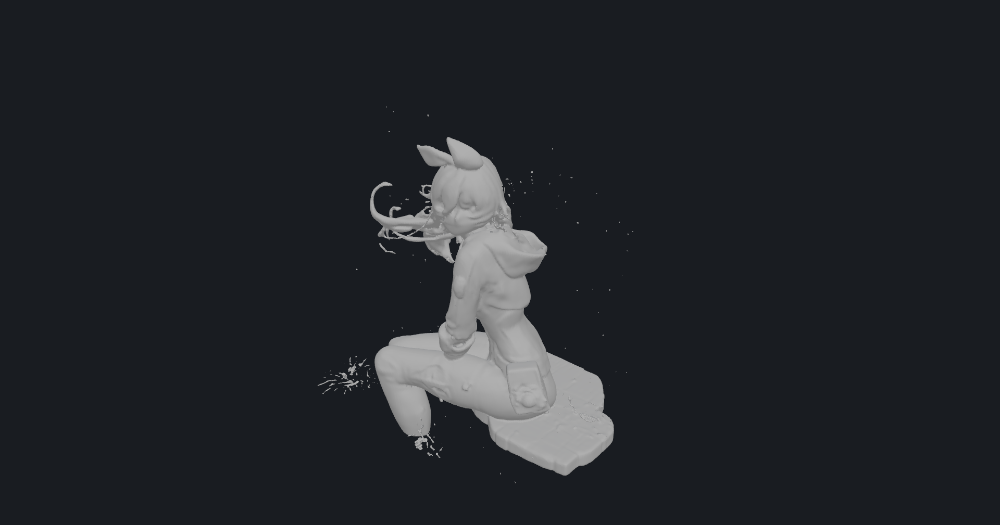

# simple-3d-viewer

A tiny GLB/glTF viewer written in Rust. Double-click a model, orbit around, done.

<p align="center">
  
</p>

## Why

Existing Rust glTF viewers are mostly stale experiments; native options on Windows are heavy (Blender) or missing (no 3D Viewer on LTSC). `simple-3d-viewer` is one small binary that opens a GLB and lets you look at it — nothing more.

## Features

- **Instant**: loads and fits the camera to the model automatically, title bar shows vertex/triangle counts
- **Orbit / pan / zoom** with the mouse
- `W` toggle wireframe overlay · `Space` toggle auto-rotate · `Esc` quit
- File dialog when launched without arguments; PBR materials and multi-mesh models supported
- Geometry-only GLBs (e.g. from Hunyuan3D) get a neutral clay material and computed normals, instead of the glTF metallic default that renders near-black without an environment map
- Headless-friendly extras: `--screenshot out.png` renders the model to an image from the GPU framebuffer, `--selftest` verifies the model actually reached the pixels (CI-friendly smoke test)
- Lightweight: plain OpenGL via [three-d](https://github.com/asny/three-d), no runtime dependencies beyond GPU drivers

## Usage

```sh
simple-3d-viewer model.glb                        # open a model
simple-3d-viewer                          # open a file dialog
simple-3d-viewer --screenshot out.png model.glb   # render ~10 frames, save an image, exit
simple-3d-viewer --selftest model.glb             # smoke test: assert the model is visible
```

## Supported formats

| Format | Support |
|--------|---------|
| GLB / glTF | ✅ best (materials, multi-mesh, node transforms) |
| OBJ | ✅ geometry + materials when embedded; external `.mtl`/textures are not resolved |
| STL | ✅ binary & ASCII |
| 3MF | ✅ |
| FBX, DAE, USD(Z), BLEND, 3DS | ❌ not planned for now — these need heavyweight SDKs |

Geometry-only files (e.g. Hunyuan3D GLB exports) get a neutral clay material and computed normals.

Works best with self-contained `.glb` files (e.g. exported from Hunyuan3D, Meshy, Blender). `.gltf` files that reference external `.bin`/textures are not resolved.

## Build

```sh
cargo build --release
# binary at target/release/simple-3d-viewer(.exe)
```

Requires the usual Rust prerequisites (on Windows: MSVC Build Tools).

## 中文简介

用 Rust 写的极简 GLB/glTF 查看器：打开即自动取景，鼠标拖拽旋转/平移/缩放，`W` 线框、`Space` 自动旋转、`Esc` 退出。不带参数启动会弹文件选择框。最适合查看 Hunyuan3D 等工具导出的自包含 `.glb` 模型。

## License

MIT
